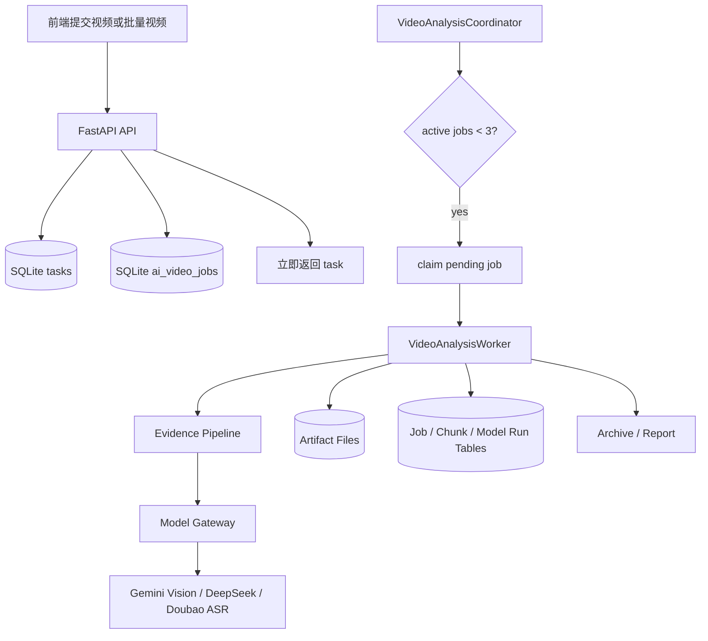

# AI 视频拆解并发架构开发计划

日期：2026-05-18

## 1. 目标

本计划用于改造当前 AI 视频拆解链路，使其可以稳定处理高峰期 100-500 条、单条约 10 分钟的视频分析任务，同时严格控制：

- 最多同时运行 3 个视频父任务。
- 每个视频任务可以断点恢复、失败重试、复用缓存。
- 任务进入队列后立即返回前端，不在 API 请求里跑完整拆解。
- 抽帧、ASR、Vision、总结等步骤都产生可追溯 evidence artifact。
- 后续可以从本地 SQLite 队列平滑升级到 Redis/Celery/Temporal。

当前项目已有基础：

- 后端：FastAPI，入口位于 `backend/app/main.py`。
- AI 视频拆解路由：`backend/app/routes/ai_video_analysis.py`。
- 任务存储：`backend/app/task_store.py`，当前使用 SQLite。
- 并发限制器：`backend/app/video_task_limiter.py`。
- Evidence pipeline：`integrations/ai_video_analysis/evidence_pipeline.py`。
- AI adapter：`integrations/ai_video_analysis/adapter.py`。
- 前端设置页：`src/features/settings/AiVideoSettingsPanel.jsx`。

## 2. 核心架构决策

### 2.1 第一版不引入重型外部队列

第一版使用 SQLite 做持久化任务队列，新增一个常驻 worker coordinator：

```text
API 请求
  -> 创建 tasks 记录
  -> 创建 ai_video_jobs 记录
  -> 返回前端

后台 coordinator
  -> 每轮最多认领 3 个 pending/retryable 视频父任务
  -> 每个父任务按阶段串行执行
  -> 阶段产物写入 evidence 目录和数据库
  -> 完成后释放 active slot
```

这样能最小化改造风险，并贴合当前项目的 SQLite 和本地文件 artifact 结构。

### 2.2 并发限制含义

`AI_VIDEO_MAX_CONCURRENT_TASKS=3` 表示全局最多 3 个视频父任务处于 active 状态。

父任务包括这些阶段：

```text
cache/download
ffmpeg audio/frame extraction
ASR submit/wait
dynamic slicing
local vision chunk analysis
global summary
report/archive
```

第一版中，一个父任务内部的 Vision chunk 默认串行执行。也就是说：

```text
最多 3 条视频同时跑
每条视频每次最多 1 个 Vision chunk 请求
全局最多 3 个 Vision chunk 请求并发
```

后续如果模型额度足够，可以加：

```env
AI_VIDEO_CHUNK_CONCURRENCY_PER_VIDEO=2
AI_VIDEO_GLOBAL_VISION_CONCURRENCY=6
```

但第一版先保持简单稳定。

### 2.3 不再依赖 FastAPI BackgroundTasks 跑批量任务

当前 `create_breakdown_job` 和抖音对标批量分析会把任务交给 `BackgroundTasks`。这对少量任务可以用，但高峰期 100-500 条时存在问题：

- API 进程重启后，尚未执行的后台任务可能丢失。
- 批量 enqueue 时容易产生大量后台函数，难以观测真实队列。
- semaphore 只能限制运行数量，不能很好管理 pending、retry、cancel、stale lock。

改造后：

- API 只负责入库。
- worker coordinator 负责认领任务。
- 所有任务状态从数据库恢复。

## 3. 目标运行模型



## 4. 任务状态设计

### 4.1 父任务状态

沿用 `tasks.status` 对前端展示：

```text
pending
running
done
failed
cancelled
```

新增 `ai_video_jobs.status` 作为内部队列状态：

```text
queued           已入队，等待 worker 认领
claimed          已被 worker 认领，准备开始
running          正在执行某个阶段
retry_waiting    可重试失败，等待 backoff
done             全部完成
failed_final     最终失败
cancelled        用户取消
stale_requeued   启动恢复时，从旧锁恢复
```

### 4.2 阶段状态

`ai_video_jobs.stage` 存当前阶段：

```text
queued
cache_check
download
probe
audio_extract
frame_extract
asr
slice
evidence_assemble
vision
summary
report
archive
done
failed
```

### 4.3 进度映射

前端进度建议固定映射，便于用户理解：

```text
0-3     排队中
4-10    缓存检查 / 下载
11-20   视频探测 / 元数据读取
21-32   音频提取
33-45   变化抽帧 / 网格图
46-58   ASR / 时间戳文本
59-64   动态语义切片
65-84   Gemini 局部分段拆解
85-94   DeepSeek 全局总结
95-100  报告归档
```

## 5. 数据库改造

当前 `task_store.py` 已有 `tasks` 和 `task_events`。建议新增以下表。

### 5.1 ai_video_jobs

用途：父任务队列和锁。

```sql
CREATE TABLE IF NOT EXISTS ai_video_jobs (
  task_id TEXT PRIMARY KEY,
  status TEXT NOT NULL DEFAULT 'queued',
  stage TEXT NOT NULL DEFAULT 'queued',
  priority INTEGER NOT NULL DEFAULT 5,
  provider TEXT NOT NULL DEFAULT '',
  video_fingerprint TEXT NOT NULL DEFAULT '',
  source_url TEXT NOT NULL DEFAULT '',
  duration REAL NOT NULL DEFAULT 0,
  progress INTEGER NOT NULL DEFAULT 0,
  attempts INTEGER NOT NULL DEFAULT 0,
  max_attempts INTEGER NOT NULL DEFAULT 3,
  locked_by TEXT NOT NULL DEFAULT '',
  locked_at INTEGER,
  heartbeat_at INTEGER,
  retry_after INTEGER,
  error_code TEXT NOT NULL DEFAULT '',
  error_message TEXT NOT NULL DEFAULT '',
  stage_state_json TEXT NOT NULL DEFAULT '{}',
  metrics_json TEXT NOT NULL DEFAULT '{}',
  created_at INTEGER NOT NULL,
  updated_at INTEGER NOT NULL
);

CREATE INDEX IF NOT EXISTS idx_ai_video_jobs_queue
ON ai_video_jobs(status, retry_after, priority, created_at);

CREATE INDEX IF NOT EXISTS idx_ai_video_jobs_lock
ON ai_video_jobs(status, locked_at, heartbeat_at);
```

### 5.2 ai_video_artifacts

用途：保存视频、音频、帧、网格图、ASR JSON、Evidence JSON、报告等产物索引。

```sql
CREATE TABLE IF NOT EXISTS ai_video_artifacts (
  id TEXT PRIMARY KEY,
  task_id TEXT NOT NULL,
  type TEXT NOT NULL,
  uri TEXT NOT NULL,
  checksum TEXT NOT NULL DEFAULT '',
  size_bytes INTEGER NOT NULL DEFAULT 0,
  meta_json TEXT NOT NULL DEFAULT '{}',
  created_at INTEGER NOT NULL,
  updated_at INTEGER NOT NULL
);

CREATE INDEX IF NOT EXISTS idx_ai_video_artifacts_task
ON ai_video_artifacts(task_id, type);
```

artifact type 建议：

```text
source_video
audio_wav
frame
frame_grid
transcript_json
evidence_json
segment_breakdown_json
global_breakdown_json
report_json
highlight_screenshot
```

### 5.3 ai_video_chunks

用途：管理每个动态切片的局部模型分析状态。

```sql
CREATE TABLE IF NOT EXISTS ai_video_chunks (
  id TEXT PRIMARY KEY,
  task_id TEXT NOT NULL,
  chunk_index INTEGER NOT NULL,
  start_time REAL NOT NULL,
  end_time REAL NOT NULL,
  status TEXT NOT NULL DEFAULT 'pending',
  transcript TEXT NOT NULL DEFAULT '',
  frame_count INTEGER NOT NULL DEFAULT 0,
  grid_uri TEXT NOT NULL DEFAULT '',
  vision_result_uri TEXT NOT NULL DEFAULT '',
  attempts INTEGER NOT NULL DEFAULT 0,
  error_message TEXT NOT NULL DEFAULT '',
  meta_json TEXT NOT NULL DEFAULT '{}',
  created_at INTEGER NOT NULL,
  updated_at INTEGER NOT NULL
);

CREATE INDEX IF NOT EXISTS idx_ai_video_chunks_task
ON ai_video_chunks(task_id, chunk_index);
```

### 5.4 ai_model_runs

用途：记录每次外部模型调用，方便成本分析和复盘。

```sql
CREATE TABLE IF NOT EXISTS ai_model_runs (
  id TEXT PRIMARY KEY,
  task_id TEXT NOT NULL,
  chunk_id TEXT NOT NULL DEFAULT '',
  provider TEXT NOT NULL,
  model TEXT NOT NULL,
  purpose TEXT NOT NULL,
  prompt_version TEXT NOT NULL DEFAULT '',
  input_uri TEXT NOT NULL DEFAULT '',
  output_uri TEXT NOT NULL DEFAULT '',
  status TEXT NOT NULL DEFAULT 'pending',
  latency_ms INTEGER NOT NULL DEFAULT 0,
  input_tokens INTEGER NOT NULL DEFAULT 0,
  output_tokens INTEGER NOT NULL DEFAULT 0,
  cost_estimate REAL NOT NULL DEFAULT 0,
  error_message TEXT NOT NULL DEFAULT '',
  created_at INTEGER NOT NULL,
  updated_at INTEGER NOT NULL
);

CREATE INDEX IF NOT EXISTS idx_ai_model_runs_task
ON ai_model_runs(task_id, purpose, status);
```

## 6. 后端模块拆分

### 6.1 新增 `backend/app/video_analysis_queue.py`

职责：

- 创建 `ai_video_jobs` 记录。
- 查询队列统计。
- 原子认领 pending/retry 任务。
- 维护 worker lock 和 heartbeat。
- 处理 stale lock 恢复。
- 提供 cancel/retry 接口需要的状态函数。

核心函数：

```python
def enqueue_ai_video_job(task_id: str, video: dict, provider: str, priority: int = 5) -> dict:
    ...

def claim_next_ai_video_job(worker_id: str) -> dict | None:
    ...

def heartbeat_ai_video_job(task_id: str, worker_id: str) -> None:
    ...

def release_ai_video_job(task_id: str, status: str, error: str = "") -> None:
    ...

def requeue_stale_ai_video_jobs(stale_seconds: int = 900) -> int:
    ...

def queue_stats() -> dict:
    ...
```

SQLite 原子认领建议使用事务：

```sql
BEGIN IMMEDIATE;
SELECT task_id
FROM ai_video_jobs
WHERE status IN ('queued', 'retry_waiting')
  AND (retry_after IS NULL OR retry_after <= ?)
ORDER BY priority ASC, created_at ASC
LIMIT 1;

UPDATE ai_video_jobs
SET status = 'claimed',
    locked_by = ?,
    locked_at = ?,
    heartbeat_at = ?,
    updated_at = ?
WHERE task_id = ?
  AND status IN ('queued', 'retry_waiting');
COMMIT;
```

### 6.2 新增 `backend/app/video_analysis_worker.py`

职责：

- 启动 3 个 worker loop。
- 每个 worker loop 持续 claim job。
- claim 成功后调用 runner。
- 捕获异常，按错误类型决定 retry 或 final fail。

核心结构：

```python
class VideoAnalysisCoordinator:
    def __init__(self, max_workers: int = 3):
        self.max_workers = max_workers
        self.stop_event = threading.Event()

    def start(self) -> None:
        ...

    def stop(self) -> None:
        ...

    def worker_loop(self, worker_id: str) -> None:
        ...
```

注意：

- worker 线程数等于 `AI_VIDEO_MAX_CONCURRENT_TASKS`，上限硬限制为 3。
- worker loop 空闲时 sleep 1-3 秒。
- 每 30 秒写一次 heartbeat。
- 启动时先调用 `requeue_stale_ai_video_jobs()`。

### 6.3 新增 `integrations/ai_video_analysis/runner.py`

职责：

- 把当前 `run_breakdown_task` 里的完整流程迁移为可阶段化 runner。
- 每个阶段完成后写 checkpoint。
- 每个阶段开始和完成都写 `task_events`。
- 统一生成 `analysis_evidence.json`。

建议结构：

```python
class AiVideoAnalysisRunner:
    def run(self, task_id: str, video: dict, provider: str, progress: Callable) -> dict:
        self.cache_check(...)
        self.download_or_reuse(...)
        self.probe(...)
        self.extract_audio(...)
        self.extract_frames(...)
        self.transcribe(...)
        self.slice(...)
        self.analyze_segments(...)
        self.summarize(...)
        self.archive(...)
```

第一版可以继续调用 `AiVideoAnalysisAdapter.create_job()`，但要尽快把内部阶段拆出来，否则无法单独重试 chunk。

## 7. API 改造

### 7.1 创建单条任务

当前：

```text
POST /api/tools/ai-video-analysis/jobs
```

改造后：

- 仍然创建 `tasks`。
- 新增创建 `ai_video_jobs`。
- 不再 `background_tasks.add_task(run_breakdown_task, ...)`。
- 返回 task 和 queue 信息。

返回示例：

```json
{
  "id": "video-breakdown-xxx",
  "status": "pending",
  "queue": {
    "position": 12,
    "active": 3,
    "pending": 148,
    "max_concurrent": 3
  }
}
```

### 7.2 批量任务

抖音对标批量入口：

```text
POST /api/tools/douyin-target/analysis/enqueue
```

改造点：

- 循环创建 task 和 ai_video_job。
- 不调用 BackgroundTasks。
- 返回 `enqueued`、`skipped`、`queue_stats`。
- 默认单次最多入队 500 条，超过则要求分批。

### 7.3 队列状态接口

新增：

```text
GET /api/tools/ai-video-analysis/queue/status
```

返回：

```json
{
  "max_concurrent": 3,
  "active": 3,
  "queued": 128,
  "retry_waiting": 4,
  "done_today": 52,
  "failed_today": 3,
  "oldest_queued_at": 1780000000,
  "workers": [
    {"id": "worker-1", "task_id": "...", "heartbeat_at": 1780000000},
    {"id": "worker-2", "task_id": "...", "heartbeat_at": 1780000000},
    {"id": "worker-3", "task_id": "...", "heartbeat_at": 1780000000}
  ]
}
```

### 7.4 取消和重试

新增：

```text
POST /api/tools/ai-video-analysis/jobs/{task_id}/cancel
POST /api/tools/ai-video-analysis/jobs/{task_id}/retry
```

取消策略：

- queued/retry_waiting：直接改为 cancelled。
- running：设置 cancel_requested，runner 在阶段边界停止。
- 不强杀 ffmpeg 子进程，第一版只做阶段边界取消。

重试策略：

- failed_final 才允许手动 retry。
- 重试时保留 artifacts，依赖 `AI_VIDEO_RESUME_ENABLED=true` 复用已完成产物。

## 8. 配置项

`.env` 建议新增或调整：

```env
AI_VIDEO_MAX_CONCURRENT_TASKS=3
AI_VIDEO_WORKER_ENABLED=true
AI_VIDEO_WORKER_POLL_INTERVAL_SECONDS=2
AI_VIDEO_WORKER_HEARTBEAT_SECONDS=30
AI_VIDEO_WORKER_STALE_SECONDS=900

AI_VIDEO_MAX_BATCH_ENQUEUE=500
AI_VIDEO_MAX_ATTEMPTS=3
AI_VIDEO_RETRY_BASE_SECONDS=60
AI_VIDEO_RETRY_MAX_SECONDS=1800

AI_VIDEO_FRAME_EXTRACT_MODE=scene
AI_VIDEO_SCENE_THRESHOLD=0.10
AI_VIDEO_FRAME_MIN_INTERVAL_SECONDS=1.0
AI_VIDEO_FRAME_FALLBACK_INTERVAL_SECONDS=8.0
AI_VIDEO_FRAME_MAX_PER_CHUNK=12
AI_VIDEO_MPDECIMATE_ENABLED=true
AI_VIDEO_PHASH_DEDUP_ENABLED=false

AI_VIDEO_MIN_CHUNK_SECONDS=45
AI_VIDEO_TARGET_CHUNK_SECONDS=90
AI_VIDEO_MAX_CHUNK_SECONDS=150
AI_VIDEO_CHUNK_OVERLAP_SECONDS=4

AI_VIDEO_ASR_PROVIDER=doubao_file_asr
AI_VIDEO_ASR_DOC_URL=https://www.volcengine.com/docs/6561/1354868?lang=zh
VOLCENGINE_ASR_APP_ID=
VOLCENGINE_ASR_ACCESS_TOKEN=
VOLCENGINE_ASR_SECRET_KEY=
VOLCENGINE_ASR_RESOURCE_ID=volc.seedasr.auc
VOLCENGINE_ASR_SUBMIT_URL=https://openspeech.bytedance.com/api/v3/auc/bigmodel/submit
VOLCENGINE_ASR_QUERY_URL=https://openspeech.bytedance.com/api/v3/auc/bigmodel/query
VOLCENGINE_ASR_ENABLE_WORD_TIMESTAMPS=true
VOLCENGINE_ASR_ENABLE_PAUSE_POINTS=true

AI_VIDEO_CHUNK_CONCURRENCY_PER_VIDEO=1
AI_VIDEO_GLOBAL_VISION_CONCURRENCY=3

# Third-party relay. Do not commit real API keys.
AI_VIDEO_RELAY_PROVIDER=yunwu
AI_VIDEO_RELAY_API_FORMAT=gemini_generate_content
AI_VIDEO_RELAY_BASE_URL=https://yunwu.ai
AI_VIDEO_RELAY_API_KEY=

# Current adapter compatibility.
AI_VIDEO_PROVIDER=yunwu
AI_ACCESS_MODE=relay
GEMINI_ACCESS_MODE=relay
GEMINI_MODEL=gemini-2.5-flash

# New model gateway defaults.
AI_VIDEO_VISION_PROVIDER=yunwu
AI_VIDEO_VISION_MODEL=gemini-2.5-flash
AI_VIDEO_SUMMARY_PROVIDER=deepseek
AI_VIDEO_SUMMARY_MODEL=deepseek-v4-flash
```

代码层面要把上限从当前 4 改成 3：

- `backend/app/video_task_limiter.py`
- `AiVideoConfigPayload.max_concurrent_tasks`
- 前端设置页的最大值和帮助文案

## 9. 抽帧策略

### 9.1 不把 mpdecimate 当作变化率阈值

`mpdecimate` 主要用于删除近似重复帧。变化率筛选建议使用 ffmpeg scene detection：

```bash
ffmpeg -i input.mp4 \
  -vf "select='gt(scene,0.10)',scale=320:-1" \
  -vsync vfr frames/scene_%05d.jpg
```

### 9.2 推荐策略

保留帧来源：

```text
1. scene > 0.10 的明显变化帧
2. 每 8 秒的兜底帧
3. 每个 chunk 开头 +1 秒的上下文帧
4. OCR 字幕变化帧，第二阶段实现
```

然后去重：

```text
1. mpdecimate 做粗去重
2. pHash 做跨时间相似图去重，第二阶段实现
3. 每个 chunk 最多保留 AI_VIDEO_FRAME_MAX_PER_CHUNK 张
```

### 9.3 产物要求

每张帧必须记录：

```json
{
  "frame_id": "frame_000123",
  "time": 82.4,
  "time_label": "01:22",
  "image_path": "...",
  "source": "scene|fallback|chunk_start|ocr",
  "scene_score": 0.16,
  "chunk_id": "seg_003"
}
```

网格图必须保留时间戳标签，并在 Evidence JSON 中保留 `frame_id -> timestamp -> chunk_id` 映射。

## 10. ASR 和动态切片

### 10.1 ASR provider 抽象

当前 `transcribers.py` 以本地 whisper 为主。新增：

```text
doubao_file_asr
```

官方文档：

```text
火山引擎豆包语音：录音文件识别
https://www.volcengine.com/docs/6561/1354868?lang=zh
```

实现时必须以该官方文档为准，重点确认：

```text
1. 鉴权方式和请求头。
2. 录音文件提交接口。
3. 任务查询或回调接口。
4. 返回字段中的句子时间戳、词级时间戳、分句、停顿信息。
5. 文件格式、大小、时长限制。
6. QPS、并发任务数和错误码。
```

接口保持统一：

```python
class Transcriber:
    def transcribe(audio_path: Path, model: str, language: str, duration: float, progress: Callable) -> dict:
        ...
```

输出统一包含：

```json
{
  "full_text": "...",
  "segments": [],
  "words": [],
  "pause_points": [],
  "speech_rate": {},
  "provider": "doubao",
  "model": "recording-file-recognition-2.0"
}
```

建议环境变量：

```env
AI_VIDEO_ASR_PROVIDER=doubao_file_asr
AI_VIDEO_ASR_DOC_URL=https://www.volcengine.com/docs/6561/1354868?lang=zh
VOLCENGINE_ASR_APP_ID=
VOLCENGINE_ASR_ACCESS_TOKEN=
VOLCENGINE_ASR_SECRET_KEY=
VOLCENGINE_ASR_RESOURCE_ID=volc.seedasr.auc
VOLCENGINE_ASR_SUBMIT_URL=https://openspeech.bytedance.com/api/v3/auc/bigmodel/submit
VOLCENGINE_ASR_QUERY_URL=https://openspeech.bytedance.com/api/v3/auc/bigmodel/query
VOLCENGINE_ASR_ENABLE_WORD_TIMESTAMPS=true
VOLCENGINE_ASR_ENABLE_PAUSE_POINTS=true
```

落地要求：

- ASR 客户端独立为 `integrations/ai_video_analysis/doubao_asr.py`。
- 上传或提交 `audio.wav` 后，任务状态写入 Evidence checkpoint。
- 异步查询不能占用整个 API 请求，只在 worker 阶段内轮询或后续升级为 callback。
- 返回结果标准化到 `transcript.json`，保留原始响应到 `transcript_raw_doubao.json`。
- 如果官方返回字段名和计划字段不同，以 adapter 层做映射，不让后续切片逻辑依赖第三方原始结构。
- API Key、App Key 等密钥只允许放在 `.env` 或系统密钥管理里，不写入文档和 evidence。

### 10.2 动态切片规则

切片优先级：

```text
1. ASR 句子边界
2. word timestamp 中的自然停顿
3. punctuation 边界
4. 视觉 scene change 边界
5. token 预算
```

建议参数：

```text
min_chunk_seconds: 45
target_chunk_seconds: 90
max_chunk_seconds: 150
overlap_seconds: 4
pause_threshold_seconds: 0.8
```

切片输出：

```json
{
  "segment_id": "seg_001",
  "start": 0.0,
  "end": 88.5,
  "time_range": "00:00-01:28",
  "transcript": "...",
  "word_range": [0, 248],
  "pause_points": [],
  "scene_boundaries": [],
  "keyframes": [],
  "keyframe_grid": {}
}
```

## 11. 第三方中转接入

本项目的视频拆解模型调用将优先支持第三方中转。当前确认的中转信息：

```text
Provider: yunwu
Base URL: https://yunwu.ai/v1
API format: OpenAI-compatible Chat Completions
Auth: Authorization: Bearer <api_key>
Gemini vision model: gemini-2.5-flash
```

注意：

- 文档、示例和测试里只能使用占位符 API Key，不能把真实密钥写入仓库。
- 截图中的 `https://yunwu.ai/v1` 已经带 `/v1`，OpenAI 兼容请求应直接拼接 `/chat/completions`。
- 不要把它拼成 `https://yunwu.ai/v1/v1/chat/completions`。
- 当前项目已有 `yunwu` provider 和 Gemini relay 相关配置，但现有 Gemini relay 代码偏 Gemini 原生 `generateContent` URL：`/v1beta/models/{model}:generateContent`。
- 这次新增的中转能力必须单独实现 OpenAI-compatible client，不能复用 Gemini 原生 URL 拼接逻辑。

### 11.1 环境变量

建议新增：

```env
AI_VIDEO_RELAY_PROVIDER=yunwu
AI_VIDEO_RELAY_API_FORMAT=gemini_generate_content
AI_VIDEO_RELAY_BASE_URL=https://yunwu.ai
AI_VIDEO_RELAY_API_KEY=
AI_VIDEO_VISION_PROVIDER=yunwu
AI_VIDEO_VISION_MODEL=gemini-2.5-flash
```

为了兼容现有全局 AI 配置，也同步写入：

```env
AI_VIDEO_PROVIDER=yunwu
AI_ACCESS_MODE=relay
GEMINI_ACCESS_MODE=relay
GEMINI_MODEL=gemini-2.5-flash
YUNWU_BASE_URL=https://yunwu.ai
YUNWU_API_KEY=
```

说明：

- `AI_VIDEO_RELAY_BASE_URL` 使用 OpenAI 兼容完整前缀 `https://yunwu.ai/v1`。
- `YUNWU_BASE_URL` 保持当前项目已有约定，默认是 `https://yunwu.ai`。
- 后续代码实现时，OpenAI-compatible client 读取 `AI_VIDEO_RELAY_BASE_URL`。
- Gemini generateContent relay client 继续读取 `YUNWU_BASE_URL` 或 `GEMINI_RELAY_BASE_URL`。

### 11.2 请求样式

Python 示例：

```python
from openai import OpenAI

client = OpenAI(
    api_key=os.getenv("AI_VIDEO_RELAY_API_KEY"),
    base_url=os.getenv("AI_VIDEO_RELAY_BASE_URL", "https://yunwu.ai/v1"),
)

resp = client.chat.completions.create(
    model="gemini-2.5-flash",
    messages=[
        {
            "role": "user",
            "content": [
                {"type": "text", "text": "请基于证据拆解这个片段。"},
                {
                    "type": "image_url",
                    "image_url": {
                        "url": "data:image/jpeg;base64,<grid_image_base64>"
                    },
                },
            ],
        }
    ],
    temperature=0.2,
)
```

如果中转不支持 `image_url` data URL，则 fallback 为：

```text
1. 只发送片段 transcript + frame timestamp index。
2. 将 grid image 上传到本地可访问静态文件或对象存储。
3. 用公网或内网可访问 URL 替换 data URL。
```

第一版先实现 data URL；如果接口返回格式或能力不支持，再加文件 URL 方案。

### 11.3 后端实现要求

新增 `integrations/ai_video_analysis/relay_clients.py`：

```python
class OpenAICompatibleRelayClient:
    def __init__(self, *, base_url: str, api_key: str):
        ...

    def chat_json(
        self,
        *,
        model: str,
        messages: list[dict],
        temperature: float = 0.2,
        timeout: int = 180,
    ) -> dict:
        ...
```

职责：

- 统一拼接 `/chat/completions`。
- 支持文本 + 网格图 data URL。
- 支持 JSON-only prompt。
- 捕获 HTTP 429/5xx 并交给上层 retry/backoff。
- 返回 raw response、parsed JSON、latency_ms、usage。
- 写入 `ai_model_runs`。

Provider 选择规则：

```text
AI_VIDEO_VISION_PROVIDER=yunwu
  -> OpenAICompatibleRelayClient
  -> base_url = AI_VIDEO_RELAY_BASE_URL
  -> api_key = AI_VIDEO_RELAY_API_KEY or YUNWU_API_KEY or AI_RELAY_API_KEY
  -> model = AI_VIDEO_VISION_MODEL or GEMINI_MODEL
```

### 11.4 与现有代码的兼容关系

现有 `integrations/ai_video_analysis/adapter.py` 中有：

```text
_uses_gemini_relay_provider()
_relay_base_url()
_generate_with_relay()
```

这些继续用于 Gemini 原生 generateContent 兼容路径。新架构中的 `model_gateway.py` 应优先使用新的 OpenAI-compatible relay client：

```text
if AI_VIDEO_RELAY_API_FORMAT=gemini_generate_content:
    use OpenAICompatibleRelayClient
else:
    use existing Gemini generateContent relay path
```

这样可以同时支持：

```text
yunwu OpenAI-compatible Chat Completions
yunwu Gemini native generateContent
official Gemini API
mock provider
```

## 12. Evidence JSON v2

建议升级 `analysis_evidence.json` 到 schema v2：

```json
{
  "schema_version": "2.0",
  "task_id": "...",
  "created_at": 1780000000,
  "updated_at": 1780000000,
  "config": {
    "max_concurrent_tasks": 3,
    "scene_threshold": 0.10,
    "chunk_overlap_seconds": 4
  },
  "models": {
    "asr": {"provider": "doubao", "model": "..."},
    "vision": {"provider": "gemini", "model": "..."},
    "summary": {"provider": "deepseek", "model": "..."}
  },
  "metadata": {
    "video_title": "...",
    "author": "...",
    "aweme_id": "...",
    "duration": 600,
    "source_url": "...",
    "video_path": "...",
    "audio_path": "..."
  },
  "transcript": {
    "full_text": "...",
    "segments": [],
    "words": [],
    "pause_points": []
  },
  "frames": [],
  "analysis_segments": [],
  "model_runs": [],
  "cost": {},
  "latency": {},
  "checkpoints": {}
}
```

原则：

- 最终报告中的关键结论必须能追溯到 segment、timestamp、frame 或 transcript。
- 所有模型输出都保存独立 JSON 文件，并在 Evidence JSON 里引用路径。
- prompt version、model version、ffmpeg 参数都写入 evidence。

## 13. 模型网关

新增或整理 `integrations/ai_video_analysis/model_gateway.py`。

职责：

- 通过第三方中转调用 `gemini-2.5-flash` 做局部分段 Vision 分析。
- DeepSeek 全局总结。
- 统一 retry、超时、429 backoff、JSON 修复。
- 记录 `ai_model_runs`。
- 支持模型别名，避免业务代码写死模型名。

配置建议：

```env
AI_VIDEO_VISION_PROVIDER=yunwu
AI_VIDEO_VISION_MODEL=gemini-2.5-flash
AI_VIDEO_RELAY_API_FORMAT=gemini_generate_content
AI_VIDEO_RELAY_BASE_URL=https://yunwu.ai
AI_VIDEO_RELAY_API_KEY=
AI_VIDEO_SUMMARY_PROVIDER=deepseek
AI_VIDEO_SUMMARY_MODEL=deepseek-v4-flash
AI_VIDEO_MODEL_TIMEOUT_SECONDS=180
AI_VIDEO_MODEL_MAX_RETRIES=2
```

模型别名层：

```python
MODEL_ALIASES = {
    "vision_fast": os.getenv("AI_VIDEO_VISION_MODEL", "gemini-2.5-flash"),
    "summary_reasoning": os.getenv("AI_VIDEO_SUMMARY_MODEL", "deepseek-v4-flash"),
}
```

## 14. 失败和重试策略

### 13.1 错误分类

```text
DOWNLOAD_FAILED      可重试 3 次
FFMPEG_FAILED        通常最终失败，除非是临时文件占用
ASR_FAILED           可重试 3 次
MODEL_RATE_LIMIT     backoff 后重试
MODEL_TIMEOUT        可重试 2 次
MODEL_PARSE_FAILED   重试 1 次，失败后保留 raw_text
REPORT_FAILED        可重试 2 次
CANCELLED            不重试
```

### 13.2 backoff

```text
retry_after = now + min(base * 2 ** attempts, max_retry_seconds)
```

默认：

```text
base = 60s
max = 1800s
```

### 13.3 部分成功策略

如果 Vision 某个 chunk 多次失败：

- 该 chunk 标记 failed。
- 允许用 transcript-only fallback 生成局部分析。
- 全局总结必须标注 `partial_evidence=true`。
- 前端报告展示“部分片段视觉分析失败”。

## 15. 前端改造

### 14.1 设置页

`src/features/settings/AiVideoSettingsPanel.jsx`：

- 并发上限改为 3。
- 默认值改为 3。
- 增加说明：这是“同时运行的视频任务数”，不是每个视频内的模型请求数。
- 增加抽帧参数：
  - scene threshold
  - fallback interval
  - max frames per chunk
  - chunk overlap seconds

### 14.2 任务列表

已有 `AnalysisTaskPanel` 可以继续用，补充：

- 显示“排队中，第 N 位”。
- 显示当前阶段：下载、抽帧、ASR、Vision、总结。
- 显示 active slots：`3/3`。
- 失败任务增加“重试”按钮。
- running/queued 任务增加“取消”按钮。

### 14.3 队列状态

新增小面板：

```text
AI 视频队列
运行中 3 / 3
等待 128
重试等待 4
今日完成 52
今日失败 3
```

## 16. 开发阶段

### Phase 0：准备和基线确认

目标：确认当前链路能跑通，记录改造前行为。

任务：

- 运行现有单条 AI 视频拆解 mock/provider。
- 记录现有 `tasks`、`task_events`、evidence 产物结构。
- 确认 `.env` 中 AI 视频配置项。
- 写一个 3 条 mock 视频的本地测试数据。

验收：

- 当前单条任务能创建、运行、归档。
- 能定位 `analysis_evidence.json`。

### Phase 1：SQLite 持久化队列

目标：替换 BackgroundTasks，任务只入库，由 worker coordinator 执行。

任务：

- 在 `task_store.py` 或新模块中新增表初始化。
- 新增 `video_analysis_queue.py`。
- 实现 enqueue、claim、heartbeat、release、stale requeue、queue_stats。
- `AI_VIDEO_MAX_CONCURRENT_TASKS` 上限改为 3。
- `POST /jobs` 改为只入队。
- `POST /douyin-target/analysis/enqueue` 改为批量只入队。
- 新增 `/queue/status`。

验收：

- 连续提交 20 个 mock 视频任务，数据库中都成为 queued。
- coordinator 最多同时 claim 3 个。
- API 请求立即返回，不等待拆解完成。
- 重启后 queued 任务仍存在。

### Phase 2：Worker coordinator

目标：后台自动消费队列。

任务：

- 新增 `video_analysis_worker.py`。
- 在 FastAPI startup hook 中启动 coordinator。
- 在 shutdown hook 中停止 coordinator。
- worker loop 调用现有 adapter/runner。
- 所有进度继续写入 `tasks` 和 `task_events`。
- stale running job 在启动时恢复为 retry_waiting 或 queued。

验收：

- 入队 10 个任务，最多 3 个 running。
- worker 完成一个任务后自动拉起下一个。
- 杀掉服务再启动，未完成任务可以继续或重试。

### Phase 3：Evidence pipeline v2

目标：优化抽帧、切片和 evidence 结构。

任务：

- 在 `evidence_pipeline.py` 增加 scene detection 抽帧。
- 增加 fallback interval 抽帧。
- 保留 chunk_start 帧。
- 可选增加 mpdecimate 去重。
- 给每帧写入 frame_id、timestamp、source、scene_score。
- 增加动态切片参数：min/target/max/overlap。
- Evidence JSON 加 `schema_version=2.0`。

验收：

- 10 分钟视频不会抽出过大的网格图。
- 静态口播视频仍有兜底帧。
- 每张网格图能回溯到具体时间戳。

### Phase 4：豆包 ASR 接入

目标：把本地 Whisper 替换或补充为豆包录音文件识别。

任务：

- 对照火山引擎官方文档实现：`https://www.volcengine.com/docs/6561/1354868?lang=zh`。
- 在 `transcribers.py` 新增 doubao provider。
- 新增 `doubao_asr.py`，封装鉴权、提交录音文件、查询任务、错误码映射。
- 支持上传 wav、轮询或 callback。
- 统一输出 full_text、segments、words、pause_points。
- 保留火山原始响应到 `transcript_raw_doubao.json`。
- 失败时支持 fallback 到本地 whisper，是否 fallback 由配置控制。
- 把 ASR provider/model 写入 Evidence JSON。

验收：

- 一条 10 分钟视频可以拿到 word timestamps。
- 切片能使用 word timestamp 和停顿点。
- ASR 失败能记录错误并重试。
- Evidence 中能追溯 ASR 文档版本、provider、model、原始响应路径。

### Phase 5：模型网关和分段分析

目标：让 Gemini 局部分析和 DeepSeek 全局总结更可控。

任务：

- 新增 `model_gateway.py`。
- 新增 `relay_clients.py`，实现云雾 OpenAI-compatible Chat Completions client。
- 用 `https://yunwu.ai/v1beta/models/{model}:generateContent` 调用 `gemini-2.5-flash` 做局部 chunk 分析。
- 支持网格图以 data URL 形式进入 message content。
- 如果 data URL 不被中转支持，fallback 到可访问图片 URL 或 transcript-only。
- 实现 DeepSeek 全局总结。
- 保存 `segment_breakdowns/{segment_id}.json`。
- 保存 `global_breakdown.json`。
- 记录 `ai_model_runs`。
- JSON 解析失败时保留 raw output。

验收：

- 每个 chunk 都有独立 checkpoint。
- 任务中断后不会重复分析已完成 chunk。
- 模型 429 会 backoff，不会直接 final fail。
- 云雾中转请求不会把 base URL 拼成重复 `/v1/v1`。

### Phase 6：前端队列体验

目标：用户能看到高峰排队情况。

任务：

- 设置页并发上限改成 3。
- 任务面板显示 queue position 和 current stage。
- 增加队列状态面板。
- 增加 retry/cancel 按钮。
- 结果页展示 evidence schema v2 的关键统计。

验收：

- 500 条入队时前端不卡死。
- 用户能看到运行中、排队中、失败、完成数量。
- 单条任务完成后报告可打开。

### Phase 7：压力测试和上线

目标：验证 100-500 条高峰场景。

任务：

- 写 mock runner 模式，不真实调用外部 API。
- 入队 100 条，确认 active <= 3。
- 入队 500 条，确认 API 快速返回，队列可观测。
- 模拟模型 429、ASR 超时、ffmpeg 失败。
- 统计每阶段 P50/P95 耗时。

验收：

- 任意时刻 active video jobs 不超过 3。
- 失败任务可重试。
- 服务重启后任务不丢。
- 单条任务的 evidence/report 可追溯。

## 17. 测试计划

### 16.1 单元测试

建议新增：

```text
tests/test_ai_video_queue.py
tests/test_ai_video_worker.py
tests/test_ai_video_evidence_pipeline.py
tests/test_ai_video_dynamic_slicing.py
```

测试点：

- `AI_VIDEO_MAX_CONCURRENT_TASKS` 最大为 3。
- queue claim 不会重复认领同一个任务。
- stale lock 可以恢复。
- retry_after 生效。
- scene/fallback 抽帧时间点合并去重。
- chunk overlap 正确。

### 16.2 集成测试

测试点：

- 创建 20 个 mock 任务，最终全部 done。
- 中途制造 2 个失败，进入 retry_waiting。
- 手动 retry 后完成。
- cancel queued 任务不会被 worker 认领。
- cancel running 任务在阶段边界停止。

### 16.3 压力测试

测试脚本建议：

```text
scripts/stress_ai_video_queue.py
```

参数：

```bash
python scripts/stress_ai_video_queue.py --count 500 --provider mock --duration 600
```

观测：

```text
active_jobs <= 3
queued count 单调下降
done + failed + cancelled + queued + running = total
worker heartbeat 正常
SQLite 无 locked database 高频错误
```

## 18. 上线顺序

推荐顺序：

```text
1. 合入队列表和 coordinator，但先 AI_VIDEO_WORKER_ENABLED=false。
2. 本地 mock 压测 100 条。
3. 打开 AI_VIDEO_WORKER_ENABLED=true，max concurrent=1 验证。
4. 提升到 max concurrent=2。
5. 提升到 max concurrent=3。
6. 接入真实 ASR 和 Gemini。
7. 接入 DeepSeek 全局总结。
8. 开启 100-500 条批量队列。
```

## 19. 迁移路径

当出现以下任一情况，再升级 Redis/Celery 或 Temporal：

- 需要多台 worker 机器横向扩容。
- SQLite 写锁成为瓶颈。
- ASR callback、长等待、取消、补偿事务变复杂。
- 需要任务 DAG 可视化和强工作流语义。

升级路径：

```text
SQLite coordinator
  -> Redis + RQ/Celery
  -> Temporal
```

第一版保留数据库结构和 runner 分层后，迁移成本会比较低。

## 20. 开发优先级

必须先做：

```text
P0 持久化队列
P0 worker coordinator
P0 max concurrent hard cap = 3
P0 queue status API
P0 evidence checkpoint 兼容现有结果
```

随后做：

```text
P1 scene detection 抽帧
P1 fallback 帧
P1 dynamic slicing
P1 model run 记录
P1 retry/cancel API
```

再做：

```text
P2 豆包 ASR
P2 OCR 字幕变化帧
P2 pHash 去重
P2 成本统计
P2 前端队列状态面板增强
```

## 20.1 P2 First Implementation Status

Completed in this pass:
- `integrations/ai_video_analysis/relay_clients.py`: OpenAI-compatible `/chat/completions` relay client. Default base URL is `https://yunwu.ai/v1`; default vision model is `gemini-2.5-flash`; URL normalization avoids `/v1/v1`.
- `integrations/ai_video_analysis/adapter.py`: when `AI_VIDEO_RELAY_API_FORMAT=gemini_generate_content`, segment analysis uses the Yunwu/OpenAI-compatible relay and sends keyframe grids as image data URLs. Provider `yunwu` is accepted for this path.
- `integrations/ai_video_analysis/doubao_asr.py`: Doubao/Volcengine recording-file ASR submit/query client skeleton. Credentials are read from `VOLCENGINE_ASR_APP_ID`, `VOLCENGINE_ASR_ACCESS_TOKEN`, and `VOLCENGINE_ASR_SECRET_KEY`; no real secrets are stored in the repo. The normalizer returns `segments`, `words`, and `pause_points`.
- `integrations/ai_video_analysis/transcribers.py`: registered the `doubao_file_asr` provider.
- `integrations/ai_video_analysis/evidence_pipeline.py`: optional dHash keyframe dedupe and OCR hook. Both are disabled by default unless env flags enable them.
- `tests/test_ai_video_p2.py`: tests for relay URL/model handling, Yunwu provider config, Doubao response normalization, and keyframe dedupe.

Still pending for the next pass:
- Add a stable public URL or object-storage upload path for `audio.wav`; Doubao file ASR needs an accessible audio URL.
- Split Gemini local vision analysis and DeepSeek global summary into a dedicated model gateway.
- Add frontend settings for the new P2 env vars.

## 20.2 P3 First Implementation Status

Completed in this pass:
- `integrations/ai_video_analysis/audio_publication.py`: added an audio publisher that copies local ASR audio into a tokenized public directory and builds a stable URL. This supports the standard Doubao/Volcengine submit/query API shape where the service pulls `audio.url`.
- `backend/app/main.py`: mounted `/api/tools/ai-video-analysis/public` to serve published ASR audio from `AI_VIDEO_ASR_PUBLIC_DIR`. A deploy must set `AI_VIDEO_ASR_PUBLIC_BASE_URL` to a URL that Volcengine can reach.
- `integrations/ai_video_analysis/doubao_asr.py`: added `AI_VIDEO_ASR_UPLOAD_MODE=url|base64`. `url` is the default for the standard recording-file API; `base64` uses `audio.data` and requires `VOLCENGINE_ASR_DIRECT_URL`, intended for direct-upload/flash-style endpoints.
- `integrations/ai_video_analysis/evidence_pipeline.py`: Evidence JSON now includes `schema_version=2.0`, an `asr` block, `metadata.audio_url`, and a separate `transcript_raw_doubao.json` checkpoint. `transcript.json` no longer stores raw ASR response inline.
- `backend/app/routes/ai_video_analysis.py`: exposed ASR upload mode/public URL/public dir config fields.
- `tests/test_ai_video_p3.py`: tests for audio publication, base64 direct upload mode, and raw ASR checkpoint separation.

Design note:
- The publisher is needed for the standard submit/query API because that API submits `audio.url`. It is not the only possible approach; direct audio transfer is supported through the new `base64` mode when the configured endpoint accepts `audio.data`. For 10-minute videos and 100-500 queued items, `url` mode remains the safer default.

Still pending for the next pass:
- Add object storage adapter support if local static serving is not publicly reachable in production.
- Add real end-to-end ASR smoke test behind explicit env flags so unit tests never call paid APIs accidentally.
- Add frontend controls/help text for `AI_VIDEO_ASR_UPLOAD_MODE`, `AI_VIDEO_ASR_PUBLIC_BASE_URL`, and direct-upload settings.

## 20.3 Volcengine TOS Publication

Reference:
- Volcengine TOS Python SDK documentation: https://www.volcengine.com/docs/6349/78455?lang=zh

Completed in this pass:
- `integrations/ai_video_analysis/audio_publication.py`: added `TosAudioPublisher`. When `AI_VIDEO_ASR_PUBLISHER=tos`, audio is uploaded to Volcengine TOS and the ASR receives a pre-signed GET URL by default.
- `requirements-base.txt`: added the `tos` Python SDK dependency.
- `integrations/ai_video_analysis/evidence_pipeline.py`: dependency status now exposes ASR publisher mode and whether a TOS bucket is configured.
- `backend/app/routes/ai_video_analysis.py`: config includes `asr_publisher`, so UI/API can switch between `local` and `tos`.
- `tests/test_ai_video_p3.py`: added fake TOS client coverage for upload and pre-signed URL generation.

Recommended production env:
```env
AI_VIDEO_ASR_UPLOAD_MODE=url
AI_VIDEO_ASR_PUBLISHER=tos
VOLCENGINE_TOS_ACCESS_KEY=
VOLCENGINE_TOS_SECRET_KEY=
VOLCENGINE_TOS_ENDPOINT=
VOLCENGINE_TOS_REGION=
VOLCENGINE_TOS_BUCKET=
VOLCENGINE_TOS_PREFIX=ai-video-asr/audio
VOLCENGINE_TOS_USE_PRESIGNED_URL=true
VOLCENGINE_TOS_PRESIGN_EXPIRES_SECONDS=86400
```

Notes:
- Real TOS credentials must stay in `.env` or deployment secret storage.
- Pre-signed URLs are safer for private buckets. If the bucket/CDN is public, set `VOLCENGINE_TOS_USE_PRESIGNED_URL=false` and optionally configure `VOLCENGINE_TOS_PUBLIC_BASE_URL`.
- This replaces the need to expose the local backend publicly for ASR audio pull access.

## 20.4 P3 Follow-up: Config UI and Safe Smoke Test

Completed in this pass:
- Frontend settings now save `asr_upload_mode`, `asr_publisher`, `asr_public_base_url`, and `asr_public_dir`. The transcriber selector includes `doubao_file_asr`; max concurrent video tasks defaults to 3 and is capped at 3 in the form.
- `src/services/api.js` forwards the new ASR/TOS config fields to `/api/tools/ai-video-analysis/config`.
- `integrations/ai_video_analysis/doubao_asr.py` exposes `doubao_asr_status()` and shared validation for Doubao ASR URL/base64 modes.
- `integrations/ai_video_analysis/evidence_pipeline.py` includes `asr_upload_mode`, publisher mode, TOS SDK readiness, sanitized TOS config status, and Doubao ASR readiness in dependency status.
- `integrations/ai_video_analysis/adapter.py` adds Doubao ASR validation to `validate_config()` only when `AI_VIDEO_TRANSCRIBER` is a Doubao/Volcengine provider.
- `scripts/smoke_ai_video_asr.py` adds an opt-in smoke path. Default usage only checks config. `--publish-only --run --audio <path>` uploads/copies audio and prints a redacted URL summary. `--transcribe --run --audio <path>` calls Doubao ASR and prints a transcript summary. Secrets and signed URL query strings are not printed.

Safe smoke commands:
```bash
python scripts/smoke_ai_video_asr.py
python scripts/smoke_ai_video_asr.py --json
python scripts/smoke_ai_video_asr.py --publish-only --run --audio data/runtime/ai_video_analysis/evidence/<job>/audio.wav
python scripts/smoke_ai_video_asr.py --transcribe --run --audio data/runtime/ai_video_analysis/evidence/<job>/audio.wav
```

Important behavior:
- The standard recording-file ASR path remains `AI_VIDEO_ASR_UPLOAD_MODE=url` because Volcengine submit/query pulls `audio.url`.
- Direct audio transfer remains available through `AI_VIDEO_ASR_UPLOAD_MODE=base64`, but it requires `VOLCENGINE_ASR_DIRECT_URL` and should only be used with endpoints that explicitly accept inline audio data.
- TOS credentials and ASR credentials stay in `.env` or deployment secret storage. They must not be saved in frontend state, docs, or committed config files.

## 20.5 P4 Follow-up: Pause-aware Chunks and MPDecimate Frames

Completed in this pass:
- `VideoEvidencePipeline.chunk_transcript()` now accepts `pause_points` and `words` from the ASR transcript. It normalizes pause candidates and, once a chunk reaches the target window, prefers a nearby pause/word-gap boundary instead of cutting only by duration.
- Chunks now include `cut_reason` (`pause_point`, `duration`, or `end`) so later debugging can explain why a segment boundary was selected.
- Added chunk tuning env vars:
  - `AI_VIDEO_CHUNK_PAUSE_TOLERANCE_SECONDS=1.2`
  - `AI_VIDEO_CHUNK_PAUSE_BONUS_SECONDS=3.0`
- Added `mpdecimate` as a first-class frame candidate mode. Set `AI_VIDEO_FRAME_EXTRACT_MODE=mpdecimate` to sample frames through `fps,mpdecimate,showinfo`, or `AI_VIDEO_FRAME_EXTRACT_MODE=hybrid` to combine chunk starts, fallback frames, scene detection, and mpdecimate candidates.
- Added mpdecimate tuning env vars:
  - `AI_VIDEO_MPDECIMATE_SAMPLE_FPS=1`
  - `AI_VIDEO_MPDECIMATE_MAX=0`
  - `AI_VIDEO_MPDECIMATE_HI=768`
  - `AI_VIDEO_MPDECIMATE_LO=320`
  - `AI_VIDEO_MPDECIMATE_FRAC=0.33`
- Dependency status now exposes pause-aware chunk settings and mpdecimate settings.

Operational note:
- `mpdecimate` does not literally mean “only extract frames where >10% of the picture changed”. It removes near-duplicate frames based on block differences. For a direct percent-like scene threshold, keep `AI_VIDEO_FRAME_EXTRACT_MODE=scene` and tune `AI_VIDEO_SCENE_THRESHOLD=0.10`.
- Recommended production default for your architecture is `AI_VIDEO_FRAME_EXTRACT_MODE=hybrid`: it keeps semantic chunk starts, scene changes, mpdecimate de-dup candidates, and sparse fallback frames, then merges close timestamps.

## 20.6 P5 Follow-up: DeepSeek Global Summary Layer

Completed in this pass:
- Added a dedicated `DeepSeekChatClient` on top of the OpenAI-compatible chat completions client.
- Global summary can now be routed independently from segment vision analysis:

```env
AI_VIDEO_SUMMARY_PROVIDER=deepseek
AI_VIDEO_SUMMARY_MODEL=deepseek-v4-flash
AI_VIDEO_SUMMARY_API_KEY=
AI_VIDEO_SUMMARY_BASE_URL=https://api.deepseek.com
```

- Segment breakdown remains on Gemini/Yunwu vision (`gemini-2.5-flash`), while `global_breakdown.json` can be generated by DeepSeek.
- `ai_model_runs` can now record the actual global summary provider/model instead of always using the Gemini segment model.
- `validate_config()` reports missing DeepSeek credentials only when `AI_VIDEO_SUMMARY_PROVIDER=deepseek`.

Follow-up status:
- DeepSeek official API smoke has passed with production credentials.

Still pending:
- Optional fallback policy if DeepSeek fails after Gemini segment analysis is already complete.
- Frontend controls for summary provider/model, if we want users to switch it from the settings page instead of `.env`.

## 20.7 P6 Follow-up: Summary Fallback and Settings UI

Completed in this pass:
- Added `AI_VIDEO_SUMMARY_FALLBACK_PROVIDER`, defaulting to `vision`.
- When `AI_VIDEO_SUMMARY_PROVIDER=deepseek` fails, global summary now falls back to the existing segment-model text path unless fallback is set to `none`.
- Backend config API now reads/saves:
  - `summary_provider`
  - `summary_model`
  - `summary_fallback_provider`
- Frontend AI video settings can now switch the final global summary provider to DeepSeek, set the summary model, and choose fallback behavior.
- Tests cover DeepSeek routing, fallback-to-segment-model behavior, and fallback-disabled failure behavior.

Recommended production setting:
```env
AI_VIDEO_SUMMARY_PROVIDER=deepseek
AI_VIDEO_SUMMARY_MODEL=deepseek-v4-flash
AI_VIDEO_SUMMARY_FALLBACK_PROVIDER=vision
```

Follow-up status:
- DeepSeek official API smoke has passed with production key.

Still pending:
- Frontend status view that shows which model was actually used for each `global_breakdown`.
- Retry/backoff budgets shared across Gemini, DeepSeek, and ASR vendors.

## 20.8 P7 Follow-up: Model Run Visibility

Completed in this pass:
- `ai_model_runs` now stores a lightweight `meta_json` payload, so fallback context is not lost.
- Task detail responses for `ai_video_analysis` now include `model_runs`.
- Worker completion and archive save paths now persist the actual model run list into `result_json`.
- Frontend task modal and analysis result modal now show provider, model, latency, token usage, status, and fallback notes for each model call.
- Tests cover model-run persistence plus round-trip visibility through task/queue storage.

Still pending:
- A dedicated queue dashboard tab for model runs across all video tasks.
- Per-stage SLOs and alert thresholds on model latency/error rate.
- Shared retry budget enforcement across ASR, vision, and summary vendors.

## 20.9 P8 Queue Dashboard and Runtime Snapshot

Completed in this pass:
- Added `GET /api/tools/ai-video-analysis/queue/status?backlog_limit=20` as a richer queue snapshot API.
- Queue snapshot now returns `workers`, `backlog`, `counts`, `queued`, `active`, `oldest_queued_at`, and per-task `position` when a task id is supplied.
- Worker runtime state is surfaced in the same snapshot, including `worker_started`, `worker_enabled`, and `thread_count`.
- Added a read-only frontend queue dashboard tab that auto-refreshes every 10s and shows queue summary, active workers, backlog order, and current task context.
- Frontend API service now exposes `fetchAiVideoQueueStatus()`.
- Tests cover queue snapshot content plus runtime-state exposure.

Still pending:
- Add queue depth / wait-time trend charting for operations.
- Add alerting or health gating when backlog grows faster than worker drain.

## 20.10 P9 Queue Control Actions

Completed in this pass:
- Queue snapshot now includes `failed_recent` so the dashboard can surface recent failures without a separate page.
- Frontend queue dashboard now supports `cancel` for queued tasks and `retry` for failed tasks.
- Added API helpers for queue cancel/retry.
- Added lightweight action state and confirm dialogs so queue operations are explicit.
- Queue card layout now reserves an action row and keeps status chips readable under load.
- Tests cover failed-job visibility in the recent snapshot.

Still pending:
- Add queue depth / wait-time trend charting for operations.
- Add alerting or health gating when backlog grows faster than worker drain.
- Decide whether recent failed tasks should be capped or grouped by error code in the next pass.

## 20.11 P10 Real External API Smoke and Relay Policy

Reference docs:
- Yunwu API docs: https://yunwu.apifox.cn/
- Volcengine recording-file ASR 2.0: https://www.volcengine.com/docs/6561/1354868?lang=zh
- Volcengine TOS Python SDK: https://www.volcengine.com/docs/6349/78455?lang=zh
- DeepSeek official API: https://api-docs.deepseek.com/

Completed in this pass:
- Added `scripts/smoke_ai_video_external_apis.py` for real external interface smoke tests. It can test TOS publication, Doubao ASR, Yunwu Gemini, and official DeepSeek independently or together.
- The smoke script is safe by default: without `--run`, it only checks config and never uploads/calls paid APIs. Signed URL query strings are redacted in output.
- Real Yunwu Gemini request has been verified with the current local config:
  - provider: Yunwu
  - API format: `gemini_generate_content`
  - model: `gemini-2.5-flash`
  - result: success, valid JSON returned.
- DeepSeek official client now uses `https://api.deepseek.com/chat/completions` for the default official base URL, instead of adding `/v1`.
- Policy enforced in code: overseas model providers such as OpenAI and Gemini must use relay/Yunwu. Native official OpenAI/Gemini branches are disabled for current tool paths.
- AI video analysis and prompt reverse now validate/use Gemini through relay credentials only. Residual `GEMINI_API_KEY` / `OPENAI_API_KEY` values are not used for these paths.
- Global summary still uses official DeepSeek, as requested.

Useful commands:
```bash
python scripts/smoke_ai_video_external_apis.py --json
python scripts/smoke_ai_video_external_apis.py --gemini --run --json
python scripts/smoke_ai_video_external_apis.py --tos --run --audio path/to/audio.wav --json
python scripts/smoke_ai_video_external_apis.py --asr --run --audio path/to/speech.wav --json
python scripts/smoke_ai_video_external_apis.py --deepseek --run --json
python scripts/smoke_ai_video_external_apis.py --all --run --audio path/to/speech.wav --json
```

Current real-interface status:
- Yunwu Gemini: done, real request succeeded.
- TOS/OSS publication: done, real upload succeeded through Volcengine TOS with a pre-signed URL.
- Doubao ASR: done, real recording-file ASR submit/query succeeded with TOS-backed audio URL.
- DeepSeek official: done, real request succeeded through `https://api.deepseek.com/chat/completions`.

Still pending:
- Run one real end-to-end queue task with a real video and verify all artifacts from `audio.wav` through final archive.

## 20.12 P10 Follow-up: Yunwu Docs Alignment

Reference:
- Yunwu API docs: https://yunwu.apifox.cn/

Completed in this pass:
- Added `GeminiGenerateContentRelayClient` in `integrations/ai_video_analysis/relay_clients.py`.
- The official AI video adapter now reuses the same Yunwu Gemini native `generateContent` client as the smoke script, so real video breakdowns and smoke tests no longer drift.
- Yunwu Gemini native path uses:

```text
POST https://yunwu.ai/v1beta/models/{model}:generateContent
Authorization: Bearer <YUNWU_API_KEY>
Content-Type: application/json
```

- Default Gemini vision model is normalized to `gemini-2.5-flash`.
- Segment text + keyframe grid requests send Gemini `parts` with text and inline image data.
- Direct full-video fallback requests send Gemini `parts` with text and inline video data, still through Yunwu relay only.
- `scripts/smoke_ai_video_external_apis.py --gemini --run --json` now calls the shared client instead of a one-off request implementation.

Verified:
- `python -m py_compile integrations/ai_video_analysis/relay_clients.py integrations/ai_video_analysis/adapter.py scripts/smoke_ai_video_external_apis.py`
- `python -m unittest discover -s tests -p "test_ai_video_*.py"`: 30 tests passed.
- Real Yunwu Gemini smoke succeeded with `gemini-2.5-flash` and `gemini_generate_content`.

Completed after follow-up:
- Volcengine TOS/OSS real smoke passed with bucket `douyinjiexi`, region `cn-beijing`, endpoint `tos-cn-beijing.volces.com`, and a pre-signed URL.
- Doubao recording-file ASR real smoke passed using `C:/Users/wu/Documents/录音/录音 (11).m4a`; normalized output included transcript segments and word timestamps.
- Yunwu Gemini real smoke passed with `gemini-2.5-flash` and `gemini_generate_content`.
- DeepSeek official real smoke passed with `deepseek-v4-flash`.
- Full external API smoke passed for TOS, ASR, Gemini, and DeepSeek in one run.

Still pending:
- Run one real end-to-end AI video breakdown queue task and verify all generated artifacts.

## 20.13 P11 External API Final Smoke Status

Completed in this pass:
- `.env` now contains the runtime configuration needed for TOS publication, Doubao ASR, Yunwu Gemini relay, and official DeepSeek. Real secrets must stay in `.env` or deployment secret storage and must not be committed.
- `python scripts/smoke_ai_video_external_apis.py --all --run --audio "C:/Users/wu/Documents/录音/录音 (11).m4a" --json` passed.
- TOS/OSS uploaded the audio and returned a redacted pre-signed URL.
- Doubao ASR recognized the sample audio successfully:
  - provider: `doubao_file_asr`
  - model: `volc.seedasr.auc`
  - language: `zh`
  - segment_count: 1
  - word_count: 16
- Yunwu Gemini returned valid JSON through native `generateContent`:
  - provider: `yunwu`
  - model: `gemini-2.5-flash`
  - api_format: `gemini_generate_content`
- DeepSeek official returned valid JSON:
  - provider: `official`
  - model: `deepseek-v4-flash`
  - base_url: `https://api.deepseek.com`

Current external API status:
- TOS/OSS: done.
- Doubao ASR: done.
- Yunwu Gemini: done.
- DeepSeek official: done.

## 20.14 P2 Generic Prompt Engine Status

Completed in this pass:
- AI 视频拆解 Prompt Engine 已从固定“玄学/AI 小动物/AI 带货”迁移到泛赛道短视频逆向工程框架。
- `genre` 会进入直接整片分析、Gemini 分段视觉拆解和 DeepSeek 全局汇总。
- 内置赛道画像：
  - `knowledge`：知识/科普
  - `beauty`：美妆/护肤
  - `commerce`：好物/种草/带货
  - `drama`：剧情/情感
  - `local_life`：探店/本地生活
  - `mysticism`：玄学/塔罗/星座
  - `generic`：泛赛道兜底
- Gemini 分段输出新增并兼容落库字段：
  - `visual_style`
  - `audio_pacing`
  - `narrative_technique`
  - `retention_mechanism`
- DeepSeek 全局输出合同新增：
  - `genre`
  - `replication_plan.cross_genre_variants`
  - `standard_remake_template`
- Evidence metadata 已保存 `genre`，方便断点结果和后续公式库回溯。
- Mock provider 已同步输出泛赛道结构，便于前端/队列在无真实模型时继续联调。

Validation passed:
- `python tests/test_ai_video_p2.py`
- `python tests/test_ai_video_evidence_p1.py`
- `python tests/test_ai_video_p3.py`
- `python tests/test_short_video_analysis_store.py`
- `python tests/test_ai_video_queue.py`

Remaining integration validation:
- Run a real video breakdown from the queue, not only isolated smoke tests.
- Verify artifacts:
  - `source_video`
  - `audio.wav`
  - `transcript.json`
  - `transcript_raw_doubao.json`
  - `keyframes.json`
  - `keyframe_grids/*.jpg`
  - `analysis_evidence.json`
  - `segment_breakdowns/*.json`
  - `global_breakdown.json`
  - final report/archive

## 20.15 P3 Generic Content Lab Frontend Status

Completed in this pass:
- AI 视频拆解结果页已从单一拆解报告升级为泛赛道“内容实验室”视图。
- `src/features/results/AnalysisResultModal.jsx` now renders:
  - 多维数据雷达图，用 `viral_scores` 和抖音衍生指标综合呈现爆款、模仿、商业、评论、收藏、破圈属性。
  - 评论区智能画像，展示通用动机桶、高频互动词、置顶/神评、作者留人话术，并在缺少评论数据时保留清晰空态。
  - 多模态双轨时间线，把每段 `visual_style` / `audio_pacing` 与 `narrative_technique` / `retention_mechanism` 并列展示。
  - 复刻实验室，展示 `standard_remake_template`、`cross_genre_variants`、Hook/Core/CTA 结构。
  - 模型调用摘要和原始 JSON，保留可追溯性。
- `src/utils/appUtils.js` now normalizes and preserves:
  - `genre`
  - `analysis_mode`
  - `pipeline_error`
  - `evidence`
  - `douyin_target.metrics`
  - `douyin_target.interaction_snapshot`
  - `segment_breakdowns` P2 multimodal fields
  - `standard_remake_template`
  - `replication_plan.cross_genre_variants`
- `src/styles.css` added responsive content-lab layouts for radar, overview, comment intelligence, timeline, remake lab, and mobile collapse.

Validation passed:
- `npm run build`
- `.venv/Scripts/python.exe -m unittest tests.test_ai_video_p3 tests.test_ai_video_p2 tests.test_ai_video_evidence_p1 tests.test_short_video_analysis_store tests.test_ai_video_queue`
  - 37 tests passed.
- Browser validation on `http://127.0.0.1:5173`:
  - App loaded with no blank page and no framework overlay.
  - Opened an existing real completed `ai_video_analysis` task through the task center.
  - Clicked `查看完整结果` and verified radar, comment intelligence, timeline, remake lab, model runs, and raw JSON render.
  - Desktop viewport had 0 console errors/warnings.
  - Mobile viewport `390x844` had 0 console errors/warnings and no horizontal overflow.

Still pending:
- Run a fresh end-to-end task from new video submission through completion, not only opening an existing completed task.
- Add richer front-end visualization once comment crawling consistently supplies top comments/replies for all genres.
- Add copy/export actions for Hook/Core/CTA and cross-genre rewritten templates.
- Add queue/model-run trend charts for operations.

## 20.16 P4 Remake Lab Action Layer Status

Completed in this pass:
- The generic content lab now has a production-oriented Remake Lab action layer.
- `src/features/results/AnalysisResultModal.jsx` added:
  - One-click copy for the complete remake package.
  - One-click copy for each structured block: standard remake template, cross-genre variants, Hook, Core, and CTA.
  - Markdown export for the complete remake package.
  - A resilient clipboard helper: it uses `navigator.clipboard.writeText()` first and falls back to selection-based copy when browser permission blocks the Clipboard API.
  - A Markdown builder that includes title, genre, summary, remake components, formula, and risk-control notes.
- `src/styles.css` added compact action rows and mobile-safe button layouts for the Remake Lab.

Validation passed:
- `npm run build`
- `.venv/Scripts/python.exe -m unittest tests.test_ai_video_p3 tests.test_ai_video_p2 tests.test_ai_video_evidence_p1 tests.test_short_video_analysis_store tests.test_ai_video_queue`
  - 37 tests passed.
- Browser validation on `http://127.0.0.1:5173`:
  - Opened an existing real completed `ai_video_analysis` task through the task center.
  - Verified the new `复制整套模板`, per-block `复制`, and `导出 Markdown` controls render in the Remake Lab.
  - Clicking `复制整套模板` shows `内容已复制`.
  - Clicking `导出 Markdown` shows `Markdown 已导出`.
  - Desktop viewport had 0 app console errors/warnings.
  - Mobile viewport `390x844` had 0 app console errors/warnings and no horizontal overflow.

Still pending:
- Add a server-side saved export record if exported templates should be searchable later.
- Add a cross-genre rewrite API action that calls DeepSeek to generate a new script from the copied structure.
- Add one-click send-to-script-generator once the production script pipeline contract is finalized.
- Run a fresh end-to-end task from new video submission through completion and verify the Remake Lab with newly generated data.

## 21. Definition of Done

这轮架构开发完成的标准：

- `.env` 中 `AI_VIDEO_MAX_CONCURRENT_TASKS=3` 时，任何场景 active 视频父任务都不超过 3。
- 批量入队 500 条时 API 能快速返回。
- worker 自动消费队列，完成一个拉起下一个。
- 服务重启后 queued/retry/running stale 任务能恢复。
- 豆包录音文件识别接入以火山引擎官方文档为准：`https://www.volcengine.com/docs/6561/1354868?lang=zh`。
- ASR 输出包含标准化 transcript、word timestamps、pause points 和原始响应 checkpoint。
- Gemini 局部分析通过云雾 Gemini 原生 `generateContent` 中转调用 `gemini-2.5-flash`。
- 中转配置使用 `.env` 或部署密钥，仓库中不提交真实 API Key。
- 单条视频的主要产物完整：
  - source video
  - audio.wav
  - transcript.json
  - keyframes.json
  - keyframe grid
  - analysis_evidence.json
  - segment breakdowns
  - global breakdown
  - final report/archive
- 任务失败时有明确 error_code、error_message、stage。
- 前端可以看到排队、运行、失败、完成。
- 压测 100 条 mock 任务通过。
- 抽帧策略包含 scene threshold、兜底帧、时间戳映射。

