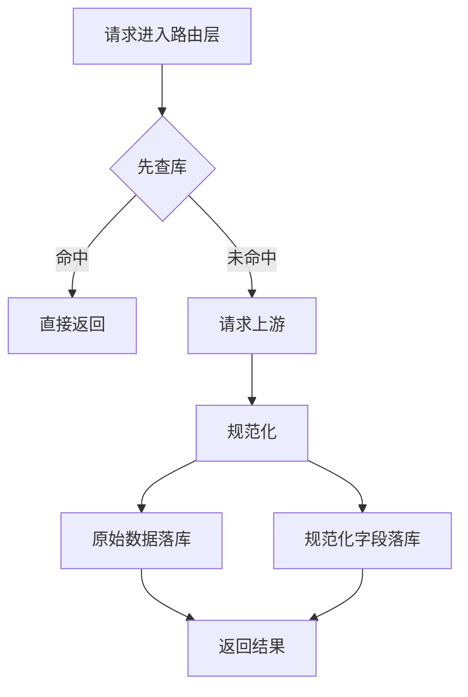

# 抖音采集链路：先查库、再上游、缓存复用方案

日期：2026-05-20

## 1. 目标

把当前抖音采集链路改成统一的“缓存优先”模式：

1. 先查本地数据库。
2. 命中则直接返回，不重复打上游。
3. 没命中或数据不完整，再请求 TikHub / Douyin Download API。
4. 原始数据和规范化数据同时落库。
5. 按关键 ID / 分页键复用缓存，减少重复请求。

适用对象：

- 搜索到的对标用户
- 用户主页信息
- 用户作品列表
- 单视频详情
- 视频评论与回复
- 互动洞察数据

## 2. 现有基础

当前项目已经有这些底座：

- `backend/app/tiktok_target_store.py`
  - `tiktok_target_users`
  - `tiktok_target_videos`
  - `tiktok_target_video_comments`
  - `tiktok_target_video_interaction_insights`
  - `tiktok_target_user_video_pages`
- `integrations/tikhub_douyin_api/adapter.py`
  - 已有用户作品分页缓存
- `integrations/douyin_download_api/adapter.py`
  - 已接统一 error 目录写盘

结论：不是推倒重来，而是把缓存策略补齐到全部读路径。

## 3. 总体架构

原则：

- **先查库，再上游**
- **原始数据 + 规范化数据双写**
- **分页缓存按请求签名复用**
- **关键字段缺失时允许补写，不回退已有好数据**

## 4. 分层设计

### 4.1 路由层

职责：

- 接收参数
- 校验请求
- 优先查数据库
- 缓存 miss 时调用 adapter
- 将结果写回仓库层

路由层不直接拼接缓存逻辑，不直接操作上游细节。

### 4.2 仓库层

职责：

- 提供 `get_or_fetch_*` / `upsert_*` 方法
- 统一处理：
  - 主键查找
  - 分页缓存查找
  - 原始 JSON 存储
  - 结构化字段合并
  - 更新时间维护

### 4.3 Adapter 层

职责：

- 只负责请求上游
- 负责响应标准化
- 负责错误日志归档
- 不决定业务缓存策略

## 5. 数据对象级方案

### 5.1 搜索结果页

对象：`keyword + cursor + douyin_user_fans + douyin_user_type + search_id`

建议新增表：

- `tiktok_target_user_search_pages`

保存内容：

- `cache_key`
- `keyword`
- `cursor`
- `search_id`
- `request_json`
- `items_json`
- `raw_json`
- `pagination_json`
- `normalized_json`
- `fetched_at`

行为：

1. 先按 `cache_key` 查库。
2. 命中就直接返回。
3. miss 才请求 TikHub。
4. 返回后落页缓存，并把命中的用户 upsert 到 `tiktok_target_users`。

### 5.2 用户主页

主键建议：

- `user_id`
- 优先补充：`sec_uid`、`unique_id`

保存字段：

- 头像
- 昵称
- 简介
- 粉丝数
- 点赞数
- 作品数
- 关注数
- 是否私密
- `recent_update_at`
- `last_post_at`
- `source_json`

合并规则：

- 文本字段：新值非空才覆盖
- 数值字段：新值更完整再覆盖
- `recent_update_at` / `last_post_at`：只允许变大，不回退到 0

### 5.3 用户作品页

现有表：

- `tiktok_target_user_video_pages`

分页键：

- `source`
- `sec_user_id`
- `unique_id`
- `max_cursor`
- `count`
- `sort_type`
- `filter_type`

行为：

1. 先查分页缓存。
2. 命中直接返回。
3. miss 才请求 TikHub。
4. 结果写入分页缓存。
5. 同步把每条视频 upsert 到 `tiktok_target_videos`。

你提到的“`cursor=10` 就先存 10 条链接，下次先查库，没有再去 TikHub”，建议保留为**梯度缓存**：

- 0、1、5、10、20……都可以作为可复用分页切片
- 先命中最接近请求的已缓存切片，再决定是否补拉上游

### 5.4 视频详情

主键：

- `video_id`
- `aweme_id`

保存字段：

- 描述
- 封面
- 播放地址
- 下载地址
- 创建时间
- 点赞 / 评论 / 分享 / 收藏 / 播放数
- `metrics_json`
- `source_json`
- 分析状态字段

规则：

- `play_count` 不能最终落 0
- 原始 0 可保留在 raw/metrics 原始字段
- 最终结构化值优先保留有效正数

### 5.5 评论与回复

主键：

- `video_id + comment_id`

保存字段：

- 评论 ID
- 父评论 ID
- 回复目标 ID
- 用户信息
- 文本
- 点赞数
- 回复数
- 创建时间
- 是否置顶
- 是否作者回复
- 层级
- `source_json`

行为：

1. 先查评论表 / 评论页缓存。
2. 命中则直接返回。
3. miss 才请求 Douyin Download API。
4. 评论和回复都落库。
5. 评论失败不阻断 AI 拆解任务，但要在任务中心标记失败状态。

### 5.6 互动洞察

现有表：

- `tiktok_target_video_interaction_insights`

保存：

- 评论数统计
- 回复数统计
- 关键词统计
- 符号统计
- 情绪画像
- 作者回复策略
- 置顶评论
- 作者回复
- Top 评论

## 6. 缓存命中与补写规则

### 6.1 命中优先级

1. 关键 ID 直接查实体表
2. 再查分页缓存表
3. 缓存命中则回填实体表缺失字段
4. 只有 miss 才请求上游

### 6.2 合并规则

- 文本字段：非空覆盖
- 数值字段：正数优先
- 时间字段：保留更大的值
- 布尔字段：`true` 优先
- 原始 JSON：按来源保留，不简单覆盖

### 6.3 过期策略

建议以后再加 TTL，但第一版可以先不强制过期，只做：

- 显式 `force_refresh`
- 字段缺失补拉
- 关键数据不完整时补写

## 7. 错误归档

上游失败统一写入：

- `data/runtime/error/<namespace>/<YYYYMMDD>/...json`

namespace 建议：

- `tikhub`
- `douyin-download-api`
- `ai-provider`

错误记录至少包含：

- 请求原件
- `path`
- `method`
- `api_base`
- `status_code`
- `response`
- `response_text`
- `traceback`
- `phase`

## 8. 需要新增的表

建议补两张缓存表：

### 8.1 `tiktok_target_user_search_pages`

用于搜索结果页缓存。

### 8.2 `tiktok_target_video_comment_pages`

用于评论页 / 回复页缓存。

这两张表的目标都是：**同一组分页参数只打一次上游**。

## 9. 落地顺序

推荐按这个顺序改：

1. 用户搜索页缓存
2. 用户主页补写
3. 用户作品分页缓存强化
4. 视频详情缓存
5. 评论页缓存
6. 互动洞察重用
7. 路由层统一收口
8. README / 文档同步更新

## 10. 结论

这套方案的核心不是“多存”，而是：

- 把上游请求变成可复用的数据入口
- 把每次请求都变成可回放的仓库记录
- 把分页和批量采集变成可缓存的稳定流程

最终目标是：

- 减少重复上游请求
- 降低失败率
- 提升任务可恢复性
- 让任务中心和数据仓库保持一致
